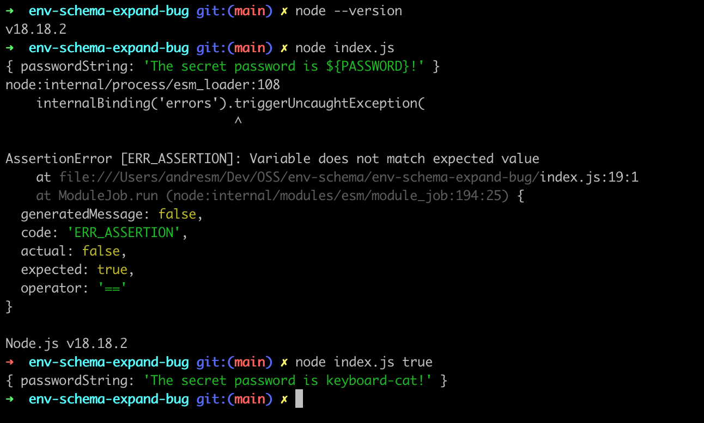

# env-schema expandEnv bug

This repo demonstrates a bug in the `expandEnv` functionality of the env-schema library as of version 5.2.0.

When the `data` option is a new object based on `process.env`, it fails to properly do variable expansion unless the `envSchema` function is called more than once.

To test this out, do the following:

```
node index.js # This calls the envSchema function only once, and results in an assertion error
node index.js true # This calls the envSchema function twice, and results in a successful script execution
```


